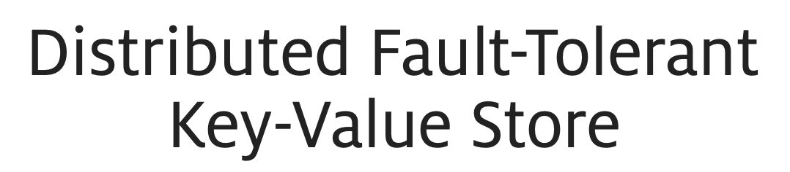
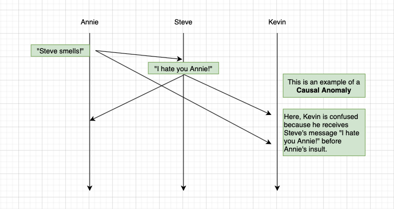
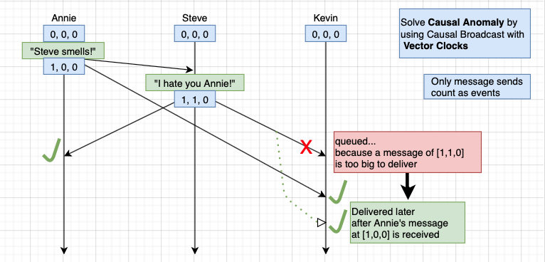
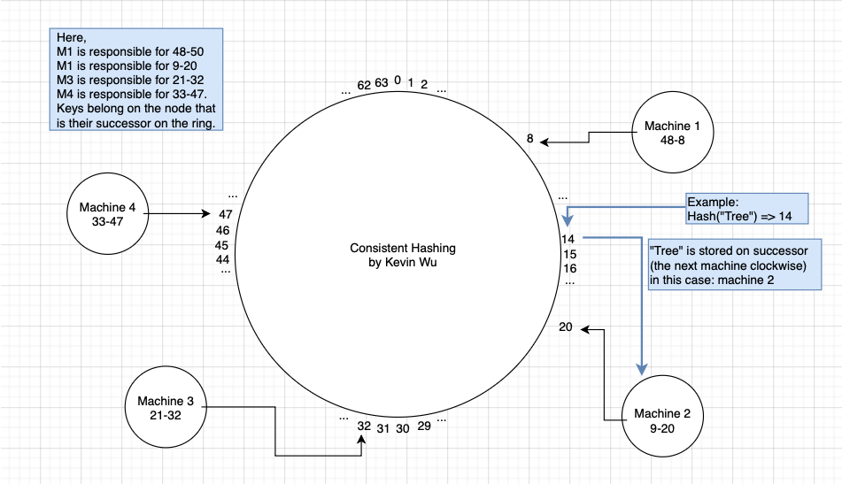
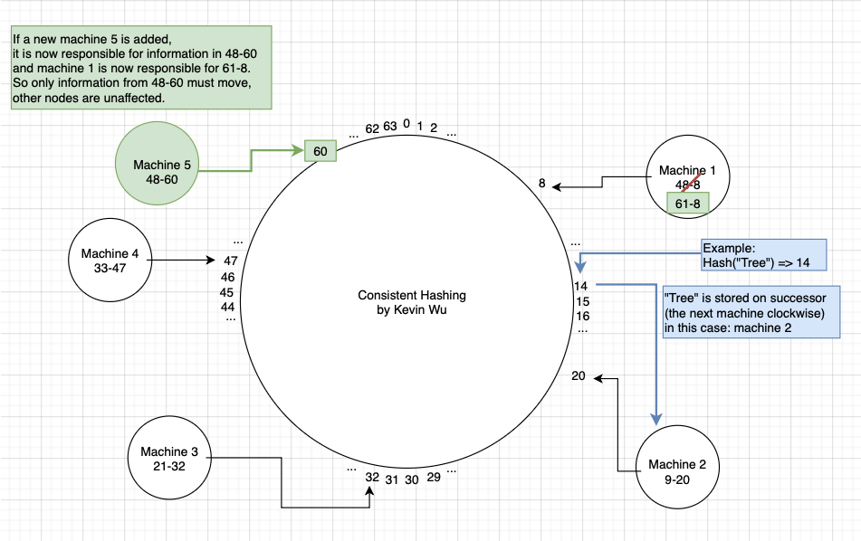
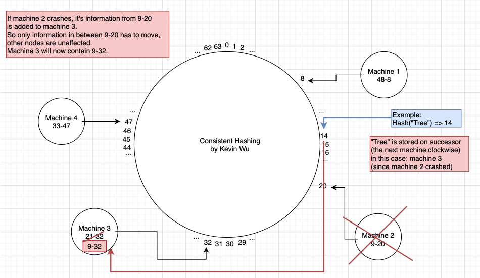

  

  Built a Distributed sharded Key-Value store that maintains causal consistency with vector clocks ensuring events take place in order. 
  Implemented Fault-Tolerance with consistent hashing, so if one node fails, it fails independently. A node failing results in its information being redistributed to a successor node without affecting other nodes, increasing performance by over 300%. 
  Supports view operations, shared operations, and key-value operations.

<h1></h1>
<h3 align="center">Causal Consistency</h3>

  
  

<h3 align="center">Consistent Hashing</h3>

  
  
  

